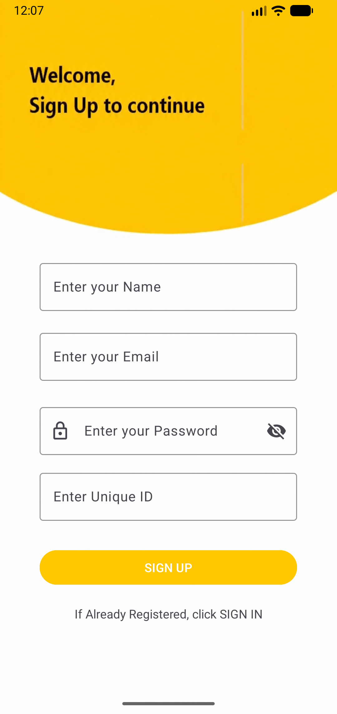

# Mobile Application - Sign In & Sign Up (Firebase)

A simple Android application developed using **Kotlin** and **Android Studio** that demonstrates user registration and authentication using **Firebase Realtime Database**. The application allows users to register with their personal details and later retrieve their information using a unique ID.

---

## 📱 Screenshots

### Sign Up Screen

<p align="center">
  
</p>

### Sign In Screen

<p align="center">
  
</p>

> **Note:** Create a folder named `screenshots` in your repository and add your screenshots as:
>
> - `signup.png`
> - `signin.png`

---

## 🚀 Features

- User Registration
- Firebase Realtime Database Integration
- Store User Information
- Unique User ID Generation
- User Data Retrieval
- Clean and Simple UI
- Success Popup after Registration
- Separate Sign Up and Sign In Screens

---

## 🛠️ Built With

- **Kotlin**
- **Android Studio**
- **Firebase Realtime Database**
- **XML Layouts**

---

## 📂 Project Structure

```
Mobile_Application_SignIn_SignUp_Page_FireBase
│
├── app/
├── gradle/
├── screenshots/
│   ├── signup.png
│   └── signin.png
├── build.gradle
├── settings.gradle
└── README.md
```

---

## ⚙️ How It Works

### User Registration

1. Enter:
   - Name
   - Email
   - Password
   - Unique ID
2. Click **Sign Up**.
3. User information is stored in Firebase Realtime Database.
4. A confirmation popup appears indicating successful registration.

---

### User Login

1. Click **Sign In**.
2. Enter the registered **Unique ID**.
3. Click **Sign In**.
4. The application searches Firebase Realtime Database.
5. If the user exists, their stored information is fetched and displayed.

---

## 🗄️ Firebase Database

The application stores user information in **Firebase Realtime Database**.

### User Data Example

```json
Users
|
|-- EMP001
      |
      |-- name : John Doe
      |-- email : john@gmail.com
      |-- password : ********
      |-- uniqueId : EMP001
```

---

## 📋 Prerequisites

Before running the project, ensure you have:

- Android Studio
- Kotlin
- Firebase Project
- Firebase Realtime Database
- Google Services JSON (`google-services.json`)

---

## ▶️ Running the Project

1. Clone the repository

```bash
git clone https://github.com/MD-ABDULLAH-KHAN/Mobile_Application_SignIn_SignUp_Page_FireBase.git
```

2. Open the project in Android Studio.

3. Connect the project with Firebase.

4. Add your `google-services.json` file inside the `app` directory.

5. Sync Gradle.

6. Run the application on an emulator or Android device.

---

## 📌 Future Improvements

- Firebase Authentication
- Password Encryption
- Email Verification
- Forgot Password
- User Profile Screen
- Input Validation
- Material Design UI
- Session Management
- Dark Mode Support

---

## 👨‍💻 Author

**MD Abdullah Khan**

GitHub:
https://github.com/MD-ABDULLAH-KHAN

---

## ⭐ Repository

If you found this project helpful, consider giving it a ⭐ on GitHub.
